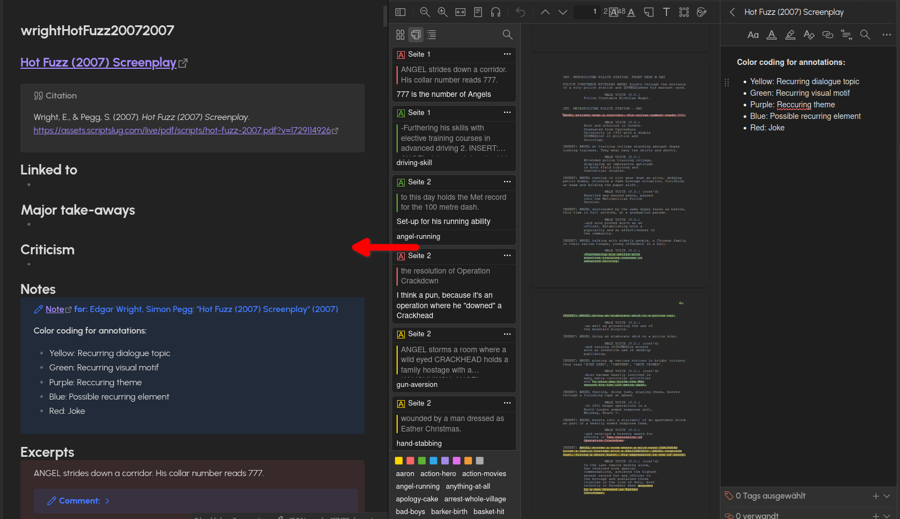
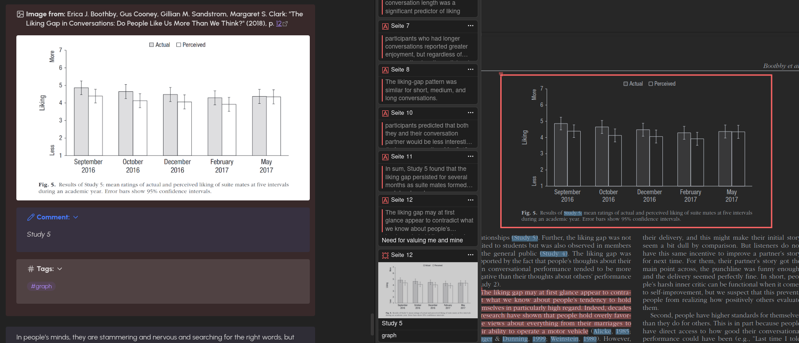
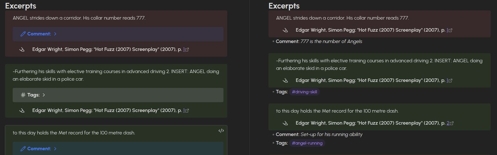

# zotero-obsidian-annotation-export
Templates for exporting annotations from Zotero into Obsidian via [Zotero integration](https://github.com/obsidian-community/obsidian-zotero-integration) and custom CSS styling. Tested with PDF and EPUB. A preset bases file with the default properties is also available.
Formatting is focused on callouts, to make embedding in other files in Obsidian easier. Some influence was taken from [Albialy's template](https://forum.obsidian.md/t/my-zotero-annotation-template-that-works/51662) (Thank you!). No AI was used.
At this moment there are two prebuilt template versions with slightly differing styling:
- "Bulleted style": Comments and tags follow after the callout as bullet points, and are therefore not included when the callout is embedded
- "Nested style": Utilizes "nested" callouts within the annotation callouts to display comments and tags
# Overview
Exported file will contain the following:
## Properties
Extracts:
- Tags
- Title (becomes searchable in Vault via automatic alias)
- Author(s)
  - Listed as items in property
- Publish date
- Citekey (as filename and property)
- Web source, if available
- ISBN, if available
- DOI, if available
- Local link with which Zotero is opened on entry
- Language
- Related works as Obsidian links
## Text
- Link to entry in Zotero
- Abstract (optional)
- Ready to copy citation in the style of your choosing
- Headers for
	- Linking to other concepts or similar in Vault
	- Summary
	- Criticism
### Attached notes
- Notes, if available, that have been attached to a work as whole in Zotero will be imported with formatting intact
	- Sorted by creation date (Earliest to latest) 
### Annotations
- Formatted into callouts
	- Colours correspond to colour selection in Zotero (RGB values sampled from Zotero with colour picker)
	- Differing symbols based on annotation type (Lucide icons: "highlighter", "underline", and "image")
	- Extraction of images supported
		- Automatically centered (CSS snippet taken from [gautamneeraj](https://forum.obsidian.md/t/align-image/78050))
  	- Formatting error with line breaks in EPUB annotation gets automatically corrected
- **Page numbers are functioning links that will open the corresponding section in Zotero**
	- Omitted automatically if the annotations were made in an EPUB (due to lack of static pages)
- Comments, if available
	- In nested style it is by default collapsed, which can be opened by clicking on the ">" symbol 
- Annotation tags, if available
	- In nested style it is by default collapsed, which can be opened by clicking on the ">" symbol 
### Related works
- Works that are marked as related in Zotero are automatically listed at the end of the exported file
	- Corresponding Zotero link is automatically generated
	- Corresponding Obsidian link is generated
		- Will be generated, even if the linked to work is not yet exported into Obsidian (as unresolved link)
## Formatting preview

# Customization options
- Properties
	- You might want to have the properties in the imported file to integrate into your existing property system. Simply change the properties at the top of the template file to how you like them in Source Mode.
- Colours of the callouts
	- Open the CSS file and there at the top you will find how the colours are defined (in RGB) for the rest of the CSS style.
- Icons of callouts
	- Can be changed in the CSS file. Simply search for `--callout-icon: ` and you will find all editable icons. Alternative icons with their names can be found on [lucide.dev](https://lucide.dev/) and do not need to be downloaded, they are pre-installed in Obsidian.
- Position of callout header
	- Default position of header is **under** the annotation. To return to the normal style of Obsidian go into the CSS and comment out/delete the sections called "Paratext under..."
- Collapsible comment & tag options
	- As default comment & tag callouts are collapsed, and can be opened by clicking ">". If you don't want this search for `"[!note]- **Comment:**"` or `[!tag]- **Tags:**` and remove the `-` or replace it with a `+` to make the default expanded, but still collapsible, if needed.
- Tag deactivation
	- Don't want tags on annotations being recognized by Obsidian? Simply add a backtick ("\`") before `{{annotation.hashTags}}` and after, and the tags will be visible, but not recognized by Obsidian.
# "Installation" guide
1. Make sure that "Zotero Integration" is installed in Obsidian and ["Better BibTeX for Zotero"](https://github.com/retorquere/zotero-better-bibtex) in Zotero. And that both programs are open at the same time!
2. Add the CSS snippet under "Appearance>CSS snippets" by clicking on the "File" symbol and copy the .css into the newly opened file explorer window.
3. Make sure that you reload the snippets (click the "cycle" symbol next to the folder symbol) and turn on the snippet.
	- Sometimes Obsidian does not immediately reload CSS. In that case, restart Obsidian manually.
5. Download one (or both) of the `.md` files and put it somewhere in your Vault (preferably into a dedicated Templates folder)
6. Open the options page for Zotero Integration and click on "Add Import Format"
7. Give the Import Format a recognizable name like "Full annotation export" (You'll have to find it in the command palette again later)
8. Set the output path (preferably to a dedicated Zotero import folder in your Vault) and make sure that it ends in `{{citekey}}.md`
9. Select the template file (Type in the name and it should suggest it to you)
10. Choose a bibliography style of your liking (or pick "American Psychological Association 7th edition", if you are not sure)

**Congratulations, you are done!** Now you can import from Zotero with the command palette and look for "Zotero Integration" and then the format name you chose. A search bar from Zotero should open up, where you can type in what you are looking for. Press Enter, and the rest should happen automatically.
# FAQ
- Why is this focused on callouts?
	- Multiple reasons:
		- Citing/Embedding an excerpt/annotation in another Obsidian note is incredibly convenient with callouts: The entire callout is always part of the embed.
		- I find it easier to visually navigate than anything else I've seen online
- What is the programming language/template engine?
  - Jinja. Learn more about how the looping and if statements are formatted [here](https://jinja.palletsprojects.com/en/stable/templates/)
- Why are the callout headers **under** the content?
  - It is closer to the usual structure of citing text in academia. If you wish to disable it, simply delete or comment out the sections in the CSS that have the headers "Paratext under..."
- What kind of citation style is used in the header of the callouts?
	- It's not a "real" citation style, and instead a mostly improvised solution that contains enough information (authors, title, year and page number) to understand at a glance the origin of the excerpt, when removed from its original context, for example as an embed.
- I have overwritten a file I modified by importing it again from Zotero! Are my changes gone?
	- Obsidian has a native file recovery plug-in. Look for "file recovery" in the command palette while in the overwritten file and check the available versions. If an older version has been saved, you can select "Restore"
		- I recommend moving modified files to a separate folder, there they will no longer be overwritten, if you import the same text from Zotero
- Why are comments automatically turned Italic?
	- To differentiate them visually more from the annotated text. Can be easily removed.
## Known issues
- Editing the properties of a template in Obsidian can cause weird behavior where Obsidian "auto-formats" values of a property (e.g. {{value}} becomes '{ value }')
	- Solution: Edit in external text editor. I recommend Kate.
